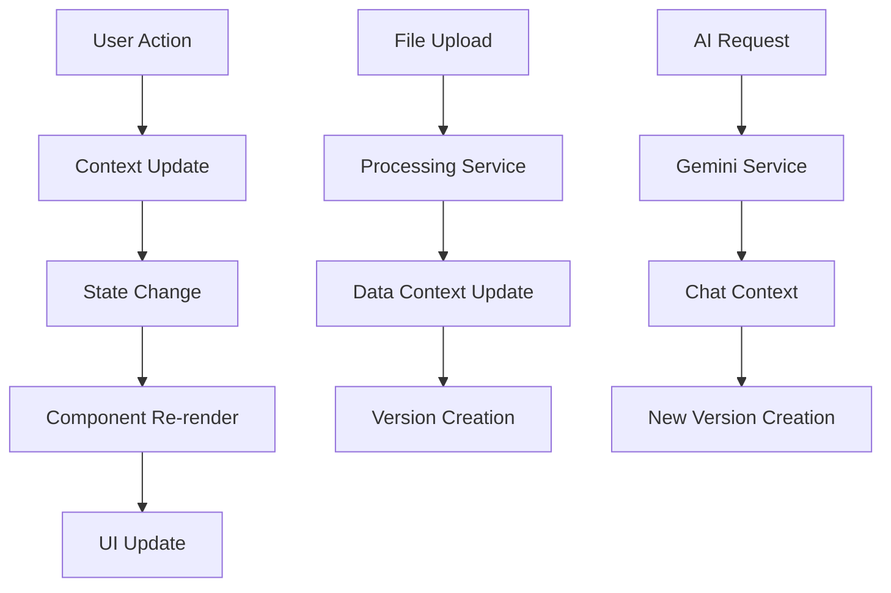

# AGENTS.md - AI Agent Developer Guide

## 📋 Table of Contents

1. [Project Overview](#project-overview)
2. [Architecture & Core Concepts](#architecture--core-concepts)
3. [Development Guidelines](#development-guidelines)
4. [Feature Development Process](#feature-development-process)
5. [Debugging Strategies](#debugging-strategies)
6. [Code Standards & Conventions](#code-standards--conventions)
7. [Testing Guidelines](#testing-guidelines)
8. [Feature Specification Templates](#feature-specification-templates)
9. [Common Patterns](#common-patterns)
10. [Troubleshooting](#troubleshooting)

---

## 🎯 Project Overview

**Plug** (Plug Uttermost) is a sophisticated **Gemini Transcription AI Editor** built with React/TypeScript and Vite. It's designed for streamlining audio transcription and editing workflows with AI-powered features.

### Core Functionality
- **Audio Processing**: Upload and play audio files with precise timeline control
- **Transcription Management**: Version-controlled transcript editing with timestamp interpolation
- **AI Integration**: Gemini API integration for transcription and intelligent text editing
- **Speaker Diarization**: Timeline-based speaker identification and management
- **Real-time Editing**: Live transcript editing with automatic saving and versioning

### Key Technologies
- **Frontend**: React 19.2.0, TypeScript 5.8.2, Vite 6.2.0
- **AI**: Google Gemini API (2.5-pro for transcription, 2.5-flash for editing)
- **State Management**: React Context API (3 contexts: Data, UI, Chat)
- **Styling**: Tailwind CSS
- **Build**: Vite with ESNext modules

---

## 🏗️ Architecture & Core Concepts

### Context Architecture

The application uses a **three-layer Context API architecture**:

#### 1. DataContext (`contexts/DataContext.tsx`)
**Purpose**: Manages all core data and business logic
- Audio files and metadata
- Transcript versions (immutable history)
- Speaker diarization data and mappings
- Data processing operations (MFA, Whisper, Pyannote integration)
- Version-based undo/redo system

#### 2. UIContext (`contexts/UIContext.tsx`)
**Purpose**: Handles user interface state
- Sidebar visibility and panel states
- Zoom levels (timeline and text)
- Modal states (settings, speaker editor)
- Keyboard shortcuts configuration
- Playback UI state

#### 3. ChatContext (`contexts/ChatContext.tsx`)
**Purpose**: Manages AI interaction state
- Chat message history
- System prompts for AI editing
- Loading states for Gemini API calls
- Asynchronous operation orchestration

### Key Data Flow



### Version Control System

The application implements a **Git-like version control** for transcripts:
- Each edit creates an immutable version in history
- "Live" editing state separate from saved versions
- Undo/Redo navigates between versions (not granular edits)
- **Interpolate** button serves as "commit" action

---

## 🚀 Development Guidelines

### Critical Principles

1. **Immutability**: Never mutate state directly - always create new objects/arrays
2. **Context Separation**: Keep data, UI, and chat logic strictly separated
3. **Version History**: All transcript changes must create new versions
4. **Type Safety**: Leverage TypeScript fully - avoid `any` types
5. **Performance**: Use memoization for expensive calculations
6. **Error Boundaries**: Wrap risky operations in try-catch blocks

### File Structure Understanding

```
src/
├── components/           # React components
│   ├── timeline/        # Timeline-specific components
│   │   ├── CanvasTimeline.tsx    # High-performance canvas timeline
│   │   └── HtmlTimeline.tsx      # Alternative HTML timeline
│   ├── TranscriptView.tsx        # Core transcript editor
│   ├── Editor.tsx               # Main editor container
│   └── [other components]
├── contexts/            # React Context providers
├── services/            # Business logic and API calls
│   ├── geminiService.ts         # AI API integration
│   └── processingService.ts     # Data processing utilities
├── types.ts            # TypeScript type definitions
└── constants.ts        # Application constants
```

### Environment Setup

1. **Dependencies**: React 19.2+, TypeScript 5.8+, Vite 6.2+
2. **Environment Variables**: `GEMINI_API_KEY` in `.env.local`
3. **Development**: `npm run dev` starts on port 3000
4. **Build**: `npm run build` for production

---

## 🔧 Feature Development Process

### Phase 1: Analysis & Planning

1. **Understand the Request**
   ```typescript
   // Example: Adding new file format support
   interface NewFeatureRequest {
     description: string;
     affectedComponents: string[];
     dataFlowChanges: boolean;
     newAPIEndpoints?: boolean;
   }
   ```

2. **Identify Impact Areas**
   - Data Context: Will this change core data structures?
   - UI Context: Does this affect user interface state?
   - Chat Context: Does this involve AI functionality?
   - Services: Are new processing functions needed?
   - Components: Which components need updates?

### Phase 2: Implementation Strategy

1. **Start with Types** (`types.ts`)
   ```typescript
   // Always define new interfaces first
   export interface NewFeatureData {
     id: string;
     data: SomeDataType;
     metadata: MetadataType;
   }
   ```

2. **Update Context(s)**
   ```typescript
   // Add to appropriate context
   const [newFeatureState, setNewFeatureState] = useState<NewFeatureData[]>([]);
   
   // Add to context value
   const value = {
     // ... existing values
     newFeatureState,
     handleNewFeature: (data: NewFeatureData) => { /* implementation */ }
   };
   ```

3. **Create/Update Services**
   ```typescript
   // Add processing functions to services/
   export const processNewFeature = (input: InputType): OutputType => {
     // Implementation with proper error handling
     try {
       // Process data
       return result;
     } catch (error) {
       console.error('Error processing new feature:', error);
       throw error;
     }
   };
   ```

4. **Build Components**
   - Follow existing component patterns
   - Use proper TypeScript interfaces
   - Implement error boundaries
   - Add loading states

### Phase 3: Integration & Testing

1. **Manual Testing Checklist**
   - [ ] Feature works in isolation
   - [ ] Doesn't break existing functionality
   - [ ] Proper error handling
   - [ ] Performance acceptable
   - [ ] Mobile responsive (if applicable)

2. **Integration Points**
   - Context providers work correctly
   - State persistence in localStorage
   - Keyboard shortcuts (if applicable)
   - Version history integration

---

## 🐛 Debugging Strategies

### Common Issues & Solutions

#### Context-Related Issues

**Issue**: Context provider not found
```typescript
// ❌ Wrong: Missing provider check
const context = useContext(DataContext);
return context.someProperty; // Will crash if null

// ✅ Correct: Proper error handling
const useData = () => {
    const context = useContext(DataContext);
    if (!context) throw new Error('useData must be used within a DataProvider');
    return context;
};
```

**Issue**: Infinite re-renders from context
```typescript
// ❌ Wrong: Recreating objects in render
const value = {
  data: someData,
  handler: () => { /* function */ } // New function every render
};

// ✅ Correct: Use useCallback and useMemo
const handler = useCallback(() => { /* function */ }, [dependencies]);
const value = useMemo(() => ({ data: someData, handler }), [someData, handler]);
```

#### State Management Issues

**Issue**: State not updating properly
```typescript
// ❌ Wrong: Mutating state directly
words.push(newWord); // Direct mutation
setWords(words);

// ✅ Correct: Immutable updates
setWords(prev => [...prev, newWord]);
```

**Issue**: Version history corruption
```typescript
// ❌ Wrong: Modifying existing versions
transcriptVersions[index].words = newWords;

// ✅ Correct: Creating new versions
const newVersions = [
  ...transcriptVersions.slice(0, index + 1),
  { name: 'New Version', words: newWords }
];
setTranscriptVersions(newVersions);
```

#### Performance Issues

**Issue**: Canvas timeline lagging
- Check `devicePixelRatio` scaling
- Verify proper canvas clearing between frames
- Ensure efficient hit testing algorithms

**Issue**: Transcript view slow scrolling
- Verify `content-visibility: auto` is applied
- Check for unnecessary re-renders in paragraphs
- Profile virtualization performance

#### AI Integration Issues

**Issue**: Gemini API failures
```typescript
// Always wrap API calls in try-catch
try {
  const response = await geminiService.transcribe(file, prompt);
  // Handle success
} catch (error) {
  console.error('Gemini API error:', error);
  // Provide user feedback
  setLoadingMessage('API request failed. Please try again.');
}
```

### Debugging Tools & Techniques

1. **React DevTools**: Essential for context debugging
2. **Console Logging**: Strategic logging in services
3. **Performance Profiler**: For canvas and virtualization issues
4. **Network Tab**: For API call debugging
5. **localStorage Inspection**: For state persistence issues

---

## 📏 Code Standards & Conventions

### TypeScript Guidelines

1. **Strict Type Safety**
   ```typescript
   // ✅ Good: Explicit interfaces
   interface ComponentProps {
     data: MatchedWord[];
     onUpdate: (words: MatchedWord[]) => void;
   }
   
   // ❌ Avoid: Any types
   const handleData = (data: any) => { /* ... */ };
   ```

2. **Null Safety**
   ```typescript
   // ✅ Good: Proper null checking
   if (word.start !== null && word.end !== null) {
     const duration = word.end - word.start;
   }
   
   // ❌ Bad: Assuming non-null
   const duration = word.end - word.start; // Could crash
   ```

### Component Standards

1. **Functional Components with Hooks**
   ```typescript
   const ComponentName: React.FC<Props> = ({ prop1, prop2 }) => {
     // State and effects
     const [state, setState] = useState<StateType>(initialValue);
     
     // Memoized calculations
     const expensiveValue = useMemo(() => calculate(prop1), [prop1]);
     
     // Event handlers
     const handleEvent = useCallback(() => { /* handler */ }, [dependencies]);
     
     return ( /* JSX */ );
   };
   ```

2. **Props Interface Naming**
   ```typescript
   // ✅ Good: Descriptive interface names
   interface TranscriptViewProps { /* ... */ }
   interface TimelineCanvasProps { /* ... */ }
   
   // ❌ Bad: Generic naming
   interface Props { /* ... */ }
   ```

### State Management Patterns

1. **Context Value Construction**
   ```typescript
   const value: ContextType = useMemo(() => ({
     // State values
     data,
     isLoading,
     
     // Handlers
     handleAction,
     handleUpdate,
   }), [data, isLoading, handleAction, handleUpdate]);
   ```

2. **Custom Hook Patterns**
   ```typescript
   export const useCustomHook = (dependency: SomeType) => {
     const [state, setState] = useState<StateType>(null);
     
     useEffect(() => {
       // Side effects
     }, [dependency]);
     
     return { state, setState };
   };
   ```

---

## 🧪 Testing Guidelines

### Component Testing Strategy

1. **Unit Tests**: Test individual functions in `services/`
2. **Integration Tests**: Test component + context interactions
3. **E2E Tests**: Test complete user workflows

### Manual Testing Checklist

#### Audio Upload & Playback
- [ ] Upload various audio formats (MP3, WAV, M4A)
- [ ] Playback controls work (play, pause, seek)
- [ ] Timeline scrubbing accurate
- [ ] Volume controls functional

#### Transcript Editing
- [ ] Text editing works in all paragraphs
- [ ] Timestamp interpolation accurate
- [ ] Version history preserved
- [ ] Undo/redo functional
- [ ] Speaker labels editable

#### AI Features
- [ ] Transcription request processes (when API enabled)
- [ ] Chat interface responsive
- [ ] Loading states display correctly
- [ ] Error handling graceful

#### File Processing
- [ ] MFA JSON parsing correct
- [ ] Whisper JSON integration works
- [ ] Pyannote diarization loads properly
- [ ] Formatted text upload functions

---

## 📝 Feature Specification Templates

### New Feature Template

```markdown
## Feature: [Feature Name]

### Description
Brief description of the feature and its purpose.

### User Stories
- As a [user type], I want to [action] so that [benefit]
- As a [user type], I want to [action] so that [benefit]

### Technical Requirements
- **Context Changes**: Which contexts need updates?
- **New Components**: What new components are needed?
- **API Changes**: Any Gemini API modifications?
- **Data Structure Changes**: New types or interfaces?

### Acceptance Criteria
- [ ] Criteria 1
- [ ] Criteria 2
- [ ] Error handling implemented
- [ ] Performance impact acceptable

### Implementation Plan
1. Phase 1: [Description]
2. Phase 2: [Description]
3. Phase 3: [Description]

### Testing Strategy
- Unit tests for new functions
- Integration tests for component interactions
- Manual testing scenarios

### Rollback Plan
How to revert changes if issues arise.
```

### Bug Report Template

```markdown
## Bug: [Brief Description]

### Environment
- Browser: [Chrome/Firefox/Safari/etc.]
- Version: [Version number]
- Platform: [OS/Device]

### Steps to Reproduce
1. Step 1
2. Step 2
3. Step 3

### Expected Behavior
What should have happened.

### Actual Behavior
What actually happened.

### Error Messages
Any console errors or user-facing messages.

### Additional Context
Screenshots, network logs, or other relevant information.

### Investigation Notes
Initial debugging steps taken.

### Proposed Solution
If known, describe potential fix.
```

### Performance Improvement Template

```markdown
## Performance: [Area to Improve]

### Current Performance
- Metric: [Current measurement]
- Issue: [Description of bottleneck]

### Target Performance
- Goal: [Target measurement]
- Success Criteria: [How to measure success]

### Profiling Results
[Performance profiler findings]

### Optimization Plan
1. Optimization 1: [Description and expected impact]
2. Optimization 2: [Description and expected impact]

### Implementation Strategy
- Changes to components
- Changes to algorithms
- Changes to data structures

### Validation Plan
How to measure improvement and ensure no regressions.
```

---

## 🔄 Common Patterns

### Context Provider Pattern

```typescript
export const CustomProvider: React.FC<{ children: React.ReactNode }> = ({ children }) => {
  const [state, setState] = useState<StateType>(initialState);
  
  const handleAction = useCallback((param: ParamType) => {
    // Action implementation
    setState(prevState => ({ ...prevState, /* updates */ }));
  }, []);
  
  const value: ContextType = useMemo(() => ({
    state,
    handleAction,
  }), [state, handleAction]);
  
  return (
    <CustomContext.Provider value={value}>
      {children}
    </CustomContext.Provider>
  );
};
```

### Service Function Pattern

```typescript
export const processData = (input: InputType): OutputType => {
  try {
    // Validation
    if (!input || !input.requiredField) {
      throw new Error('Invalid input data');
    }
    
    // Processing logic
    const result = transformData(input);
    
    // Validation of result
    if (!isValidResult(result)) {
      throw new Error('Processing failed validation');
    }
    
    return result;
  } catch (error) {
    console.error('Error in processData:', error);
    throw error; // Re-throw for caller to handle
  }
};
```

### Component with Context Pattern

```typescript
interface ComponentProps {
  customProp: PropType;
}

const Component: React.FC<ComponentProps> = ({ customProp }) => {
  const { contextData, contextAction } = useCustomContext();
  const { uiState, setUiState } = useUI();
  
  const handleClick = useCallback(() => {
    contextAction(customProp);
    setUiState(prev => ({ ...prev, someUiChange: true }));
  }, [customProp, contextAction, setUiState]);
  
  return (
    <div>
      {/* Component JSX */}
    </div>
  );
};
```

### Version Creation Pattern

```typescript
const createNewVersion = useCallback((newWords: MatchedWord[], versionName: string) => {
  const newVersion: TranscriptVersion = {
    name: versionName,
    words: newWords
  };
  
  // Add to history, removing any "future" versions if not at latest
  const newVersions = [
    ...transcriptVersions.slice(0, currentVersionIndex + 1),
    newVersion
  ];
  
  setTranscriptVersions(newVersions);
  setCurrentVersionIndex(newVersions.length - 1);
}, [transcriptVersions, currentVersionIndex]);
```

---

## 🚨 Troubleshooting

### Startup Issues

**Problem**: Application won't start
1. Check Node.js version (requires compatible version)
2. Clear `node_modules` and reinstall: `rm -rf node_modules package-lock.json && npm install`
3. Check for port conflicts (default 3000)
4. Verify environment variables in `.env.local`

### Runtime Errors

**Problem**: Context provider errors
1. Ensure component is wrapped in correct provider
2. Check provider hierarchy in `App.tsx`
3. Verify context imports are correct

**Problem**: State not persisting
1. Check localStorage access (may be disabled in private browsing)
2. Verify serialization/deserialization in context
3. Check for circular references in state objects

### Performance Issues

**Problem**: Canvas timeline sluggish
1. Check canvas scaling with `devicePixelRatio`
2. Verify efficient drawing (avoid unnecessary redraws)
3. Profile with browser dev tools

**Problem**: Transcript editing slow
1. Check paragraph virtualization
2. Verify memoization in expensive calculations
3. Profile React component renders

### AI Integration Issues

**Problem**: Gemini API not working
1. Verify `GEMINI_API_KEY` environment variable
2. Check network connectivity
3. Review API usage limits and quotas
4. Check console for error messages
5. Verify service is not disabled in `geminiService.ts`

---

## 💡 Best Practices for Agent Development

### Pre-Development Checklist
- [ ] Read existing code thoroughly before making changes
- [ ] Understand the data flow through contexts
- [ ] Identify all components that might be affected
- [ ] Check for existing similar patterns to follow
- [ ] Review the version history system implications

### During Development
- [ ] Make small, incremental changes
- [ ] Test each change thoroughly before moving on
- [ ] Keep context separation principles
- [ ] Add proper TypeScript types for new code
- [ ] Use existing utility functions when possible

### Post-Development
- [ ] Test the complete user workflow
- [ ] Verify no performance regressions
- [ ] Check browser console for errors
- [ ] Validate localStorage persistence
- [ ] Document any new patterns or utilities created

### Code Review Guidelines
- Verify type safety and null checks
- Ensure proper context usage
- Check for memory leaks in event handlers
- Validate error handling is comprehensive
- Confirm performance implications are acceptable

---

*This guide serves as a living document for AI agents working on the Plug transcription editor. Update it as new patterns emerge or architectural changes are made.*